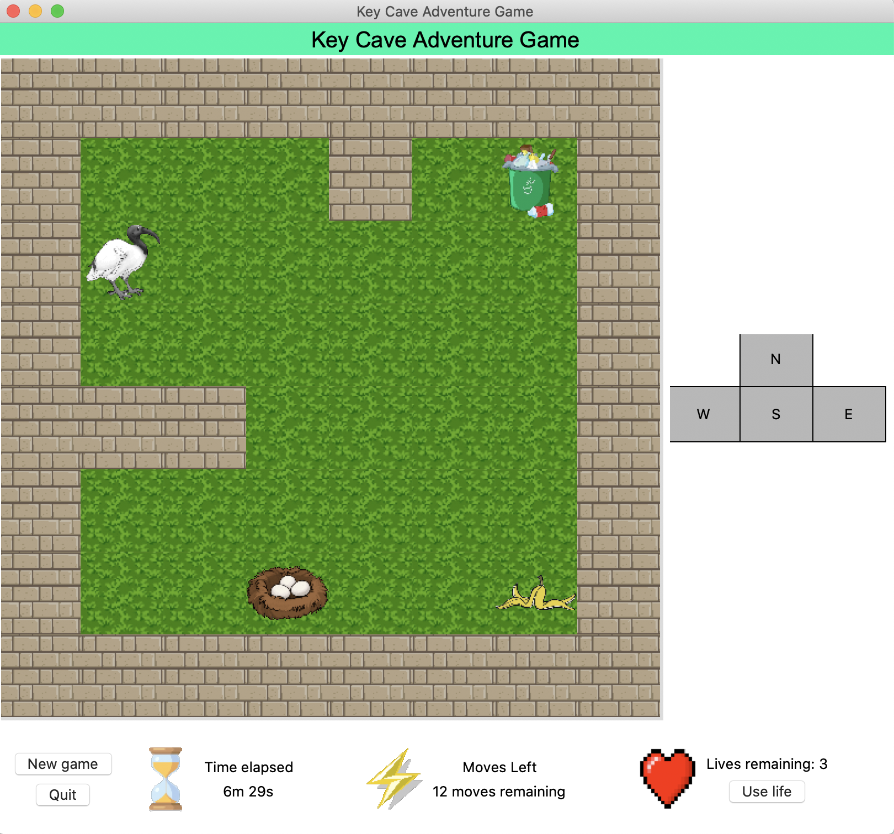

# tkinter_GUI_sample
 A tiny game implement with tkinter

 The GUI of the highest version is like this.
 

 To win this game the bird needs to get to the trash first then take it to the nest with limited steps. Eating the banana peel will increase the remaining steps. With the button "Use live", one most resent move can be undone.

 There will be a highest scoreboard after you finish the game, and the faster you finish the game the better you are.

 Please this is just a tiny GUI game implemented with tkinter.
